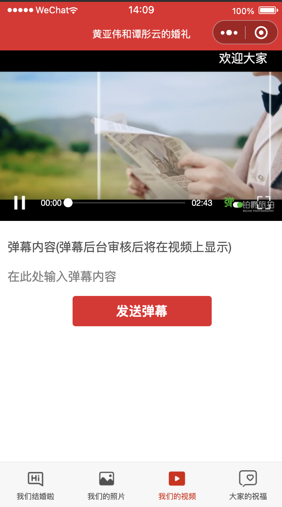
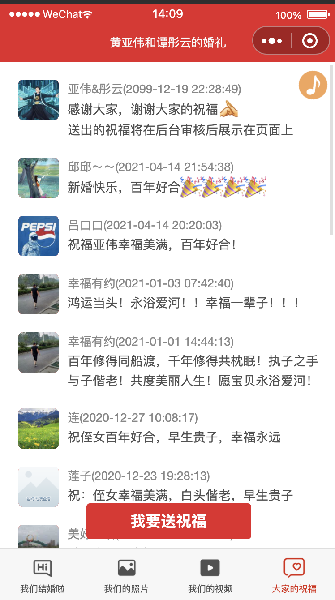

 # 【云开发应用】-【结婚电子请柬】

 ## 体验二维码

## 介绍
### 应用场景
作为一个发送给亲朋好友的结婚电子请柬

### 目标用户
被邀请来参加婚礼的所有亲朋好友

### 实现思路
主要分为四个模板，主模板作为请柬的核心部分，提供给来参与婚礼的亲朋好友知道婚礼的时间和地点、已经导航信息；剩下模板包括新人的照片、视频已经大家对新人的祝福

### 效果图
> 我们结婚啦

> 我们的照片

> 我们的视频

> 大家的祝福

## 模块介绍
主要分为四个模块：
（1）我们结婚了【图片及地址时间信息使用了云开发】
（2）我们的照片【照片使用了云开发】
（3）我们的视频【视频使用了云开发】
（4）大家的祝福【祝福的提交和查询使用了云开发】

## 开发
由于使用了云开发，需要自己申请云开发资源，在app.json中配置云开发资源ID